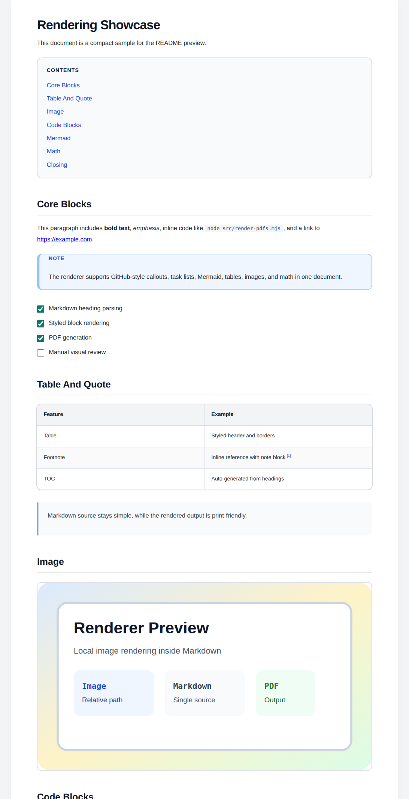
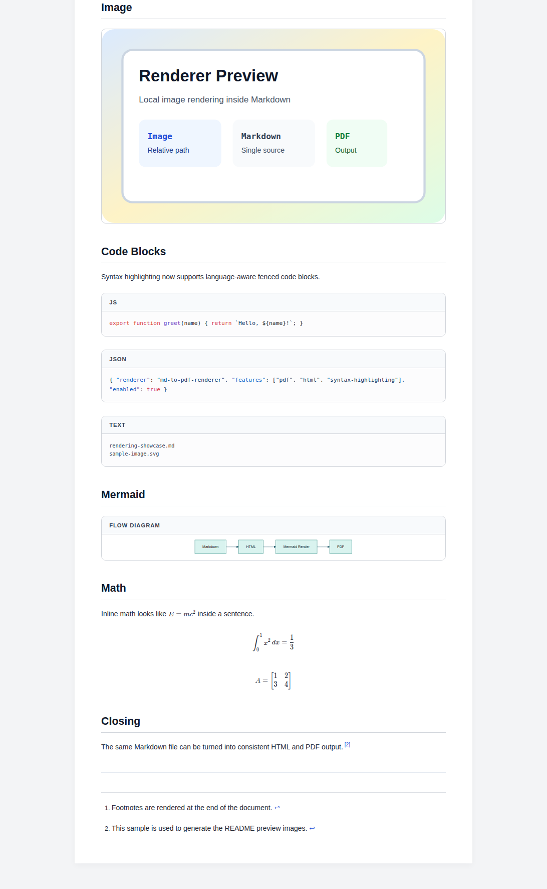

# md-to-pdf-renderer

`md-to-pdf-renderer` is a standalone Node.js tool that converts Markdown documents into print-ready PDF files, with optional HTML output.

It is designed for documentation export workflows where the same Markdown source should be rendered consistently with:

- A4-oriented PDF layout
- Mermaid diagram rendering
- Styled code blocks and plain-text blocks
- Tables, blockquotes, and general document formatting
- Task lists, footnotes, and GitHub-style callouts
- `[[TOC]]` placeholder based table of contents
- Inline and block math rendering with KaTeX
- A generated manifest file for produced PDFs

### Quickstart For Humans And Agents

Fastest successful path:

```bash
npx md-to-pdf-renderer --input fixtures/readme-showcase --output out --log-file
```

Expected output:

- `out/rendering-showcase.pdf`
- `out/README.md`
- `out/render.log`

Tool contract:

- Input is the top-level `*.md` files in the `--input` directory.
- Output is `*.pdf` and a manifest `README.md` in `--output`.
- Intermediate HTML files are only written when `--html <dir>` is provided.
- For automation, prefer passing both `--input` and `--output` explicitly instead of relying on defaults.
- The command exits with a non-zero status when the input directory is missing, empty, or when Mermaid rendering fails.
- On Linux ARM boards, prefer a system Chromium or Chrome path via `--chrome-path` or `PUPPETEER_EXECUTABLE_PATH`.

### Preview

Example source: `fixtures/readme-showcase/rendering-showcase.md`

Generated output:

- `fixtures/readme-showcase-output/rendering-showcase.pdf`
- `fixtures/readme-showcase-output/html/rendering-showcase.html`

The preview HTML above was generated with `--html fixtures/readme-showcase-output/html`.

<p>
  
  
</p>

### What it does

When you run the renderer:

1. It scans the input directory for top-level `*.md` files.
2. It converts each Markdown file into rendered HTML in memory.
3. It opens that HTML in a bundled Puppeteer-managed browser.
4. It renders Mermaid blocks before printing.
5. It writes the final PDF files.
6. It optionally writes intermediate HTML files when `--html <dir>` is set.
7. It creates a `README.md` manifest inside the PDF output directory.

### Requirements

- Node.js
- `npm install` for this tool directory
- No separate Chrome installation is required by default
- Network access for Mermaid ESM loading from jsDelivr at render time
- Linux ARM boards may need a system Chromium or Chrome executable instead of Puppeteer's bundled browser

### Dependencies

- `markdown-it`
- `markdown-it-footnote`
- `markdown-it-task-lists`
- `katex`
- `mermaid`
- `puppeteer`

### Install

From the tool directory:

```bash
npm install
```

### Usage

Quick start with `npx`:

```bash
npx md-to-pdf-renderer
```

Show CLI help:

```bash
npx md-to-pdf-renderer --help
```

```bash
npx md-to-pdf-renderer --input input --output output --paper-size A4 --orientation portrait --log-file
```

Save intermediate HTML too:

```bash
npx md-to-pdf-renderer --input input --output output --html output/html
```

Linux ARM example:

```bash
npx md-to-pdf-renderer --input input --output output --chrome-path /usr/bin/chromium
```

Run from the repository root:

```bash
node src/render-pdfs.mjs --input input --output output --paper-size A4 --orientation portrait
```

### CLI options

| Option | Description | Default |
| ---- | ---- | ---- |
| `--input` | Directory containing source Markdown files | Current working directory |
| `--output` | Directory where PDF files are written | `output` |
| `--html` | Also write intermediate HTML files to this directory | Disabled |
| `--paper-size` | Print paper size such as `A4`, `Letter`, `Legal`, `A3`, or `210mm 297mm` | `A4` |
| `--orientation` | Print orientation: `portrait` or `landscape` | `portrait` |
| `--log-file` | Write progress logs to `<output>/render.log` | Disabled |
| `--chrome-path` | Optional path to a custom Chrome or Chromium executable | Bundled Puppeteer browser |

### Output structure

The tool generates:

- `<output>/*.pdf`
- `<output>/README.md`
- `<output>/render.log` when `--log-file` is enabled
- `<html>/*.html` only when `--html <dir>` is enabled

Example:

```text
input/
  01-overview.md
  02-architecture.md

output/
  01-overview.pdf
  02-architecture.pdf
  README.md
  render.log

output/html/
  01-overview.html
  02-architecture.html
```

### Rendering notes

- The title of each document is taken from the first Markdown `# Heading` when available.
- If no top-level heading exists, the file name is converted into a readable title.
- Mermaid fences using ```` ```mermaid ```` are rendered as diagrams.
- Code fences using ```` ```text ```` are rendered with a plain text oriented layout.
- Task lists using `- [x]` and `- [ ]` are rendered with checkbox styling.
- Footnotes using `[^name]` syntax are rendered at the end of the document.
- GitHub-style callouts such as `> [!NOTE]` and `> [!WARNING]` are rendered as callout cards.
- `[[TOC]]` is replaced with a generated table of contents linking to document headings.
- Inline math using `$...$` and block math using `$$...$$` are rendered with KaTeX.
- The generated PDFs use print CSS and support `--paper-size` plus `--orientation`.
- Render progress is always printed to the console.
- Intermediate HTML files are skipped by default and are only persisted when `--html <dir>` is passed.
- `<output>/render.log` is only written when `--log-file` is enabled.
- Mermaid rendering errors fail the command instead of silently producing a broken diagram in the PDF.
- Missing, empty, or invalid input directories fail with a clear error message.
- On Linux ARM, the bundled Puppeteer browser may be unusable, so pass `--chrome-path` or set `PUPPETEER_EXECUTABLE_PATH`.

### License

MIT
