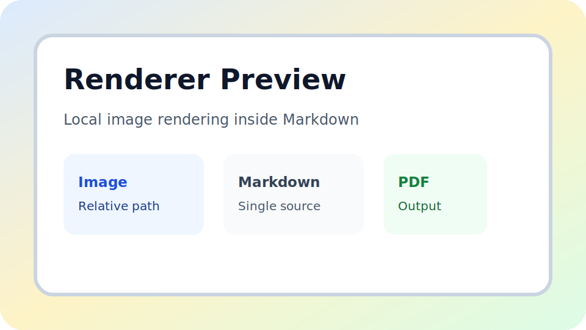
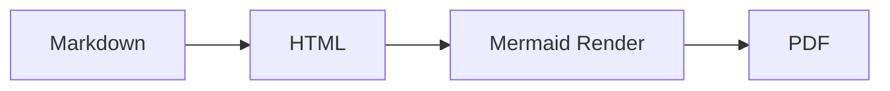

# Rendering Showcase

This document is a compact sample for the README preview.

[[TOC]]

## Core Blocks

This paragraph includes **bold text**, *emphasis*, inline code like `node src/render-pdfs.mjs`, and a link to <https://example.com>.

> [!NOTE]
> The renderer supports GitHub-style callouts, task lists, Mermaid, tables, images, and math in one document.

- [x] Markdown heading parsing
- [x] Styled block rendering
- [x] PDF generation
- [ ] Manual visual review

## Table And Quote

| Feature | Example |
| ---- | ---- |
| Table | Styled header and borders |
| Footnote | Inline reference with note block[^footnote] |
| TOC | Auto-generated from headings |

> Markdown source stays simple, while the rendered output is print-friendly.

## Image



## Code Blocks

Syntax highlighting now supports language-aware fenced code blocks.

```js
export function greet(name) {
    return `Hello, ${name}!`;
}
```

```json
{
  "renderer": "md-to-pdf-renderer",
  "features": ["pdf", "html", "syntax-highlighting"],
  "enabled": true
}
```

```text
rendering-showcase.md
sample-image.svg
```

## Mermaid



## Math

Inline math looks like $E = mc^2$ inside a sentence.

$$
\int_{0}^{1} x^2 \, dx = \frac{1}{3}
$$

$$
A =
\begin{bmatrix}
1 & 2 \\
3 & 4
\end{bmatrix}
$$

## Closing

The same Markdown file can be turned into consistent HTML and PDF output.[^second]

[^footnote]: Footnotes are rendered at the end of the document.
[^second]: This sample is used to generate the README preview images.
